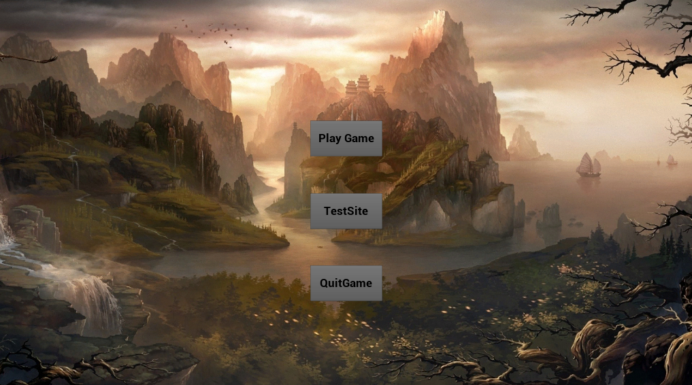
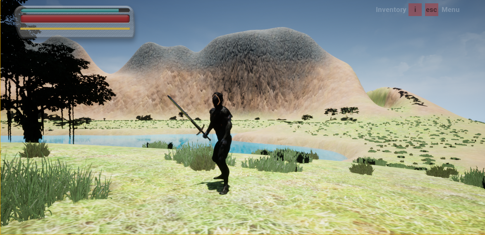
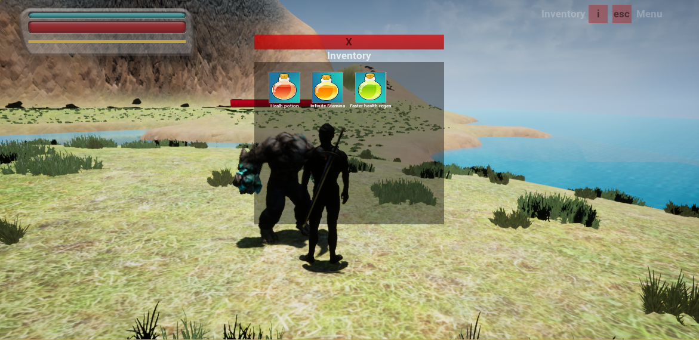
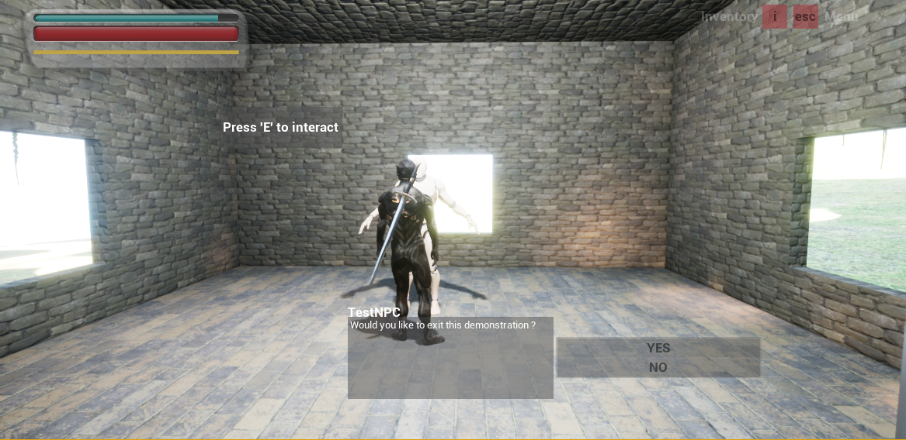

<link rel="stylesheet" href="https://maxcdn.bootstrapcdn.com/bootstrap/3.4.1/css/bootstrap.min.css">
<html>
        <head>
            <meta charset="utf-8">
        </head>
        <body>

                <h1 title="Title">Projet d'intégration sur Unreal Engine</h1>
                <h2>Programmeurs : </h2>
                <table class="table">
                        <tr>
                            <th style="text-align: left">NOM :</th>
                            <th style="text-align: left">COURRIEL :</th>
                        </tr>
                        <tr>
                            <td>Philippe Poirier</td>
                            <td>Ppoirier2699@gmail.com</td>
                        </tr>
                </table>
                <h2>Description du projet :</h2>
                

                    Pour mon projet d'intégration, j'ai décider de faire un jeu sur Unreal Engine en c++.
                    Il s'agit d'un jeu RPG dans lequel le personnage peut parler a des NPC et obtenir des quêtes,
                    le joueur doit combattre différents types d'ennemis et compléter les objectifs de quêtes pour progresser dans le jeu.
                    Le joueur a accès a un inventaire dans lequel il peut storer n'importe quel objects et utiliser les consomables.
                

                <h2 class="font-weight-bold">Listes de commandes du jeu :</h2>
                <table class="table">
                    <tr>
                        <th style="text-align: left">BOUTTON :</th>
                        <th style="text-align: left">FONCTIONALITÉ :</th>
                    </tr>
                    <tr>
                        <td>W/A/S/D</td>
                        <td>Déplace le personnage</td>
                    </tr>
                    <tr>
                        <td>SHIFT</td>
                        <td>Active le sprint</td>
                    </tr>
                    <tr>
                        <td>I</td>
                        <td>Ouvre l'inventaire</td>
                    </tr>
                    <tr>
                        <td>C</td>
                        <td>Sortir/Ranger l'arme</td>
                    </tr>
                    <tr>
                        <td>CLIC GAUCHE</td>
                        <td>Attaque si l'arme est sortie</td>
                    </tr>
                    <tr>
                        <td>ESC</td>
                        <td>Pause le jeu</td>
                    </tr>
                    <tr>
                        <td>Q</td>
                        <td>Ouvre le livre des quêtes</td>
                    </tr>
                </table>

 <h2 class="font-weight-bold">Images du jeu :</h2>

<h2 class="font-weight-bold">Superviseur du projet : Kyle Ross</h2>
<h2 class="font-weight-bold">Lien vers une courte presentation du jeu :</h2>
<a href="https://youtu.be/dfHOfXC0ykU"> Lien vers la video </a>
          
</body>
</html>